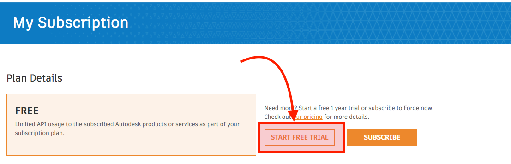

# 章節一 Forge 開發者帳號建立及註冊

以下內容將帶領你進行 Autodesk Forge 開發者帳號註冊

 

## 建立你的 Forge 帳號

1. 使用網頁瀏覽器開啟 Autodesk Forge 官方網站 [https://developer.autodesk.com/](https://developer.autodesk.com/)
2. 滑鼠點擊 SIGN UP 按鈕註冊新的帳號（已經有帳號的同學請直接進行步驟4）
3. 註冊完成後到，所填寫的信箱收信，點擊信件裡的註冊驗證連結
4. 滑鼠點擊 SIGN IN 登入，登入已註冊且驗證完成的開發者帳號

## 開始免費試用

在開始使用任何 Forge APIs 以前（如 Viewer, Model Derivative 等），我們需要從網頁上面的選單裡的 **My Subscription** 開啟**免費試用**

## 建立 Forge App

在正式開始使用任何 Forge  服務以前，我們需要在網頁上面的選單裡的**My Apps**裡，建立一個 Forge App，以下建立步驟：

1. 點擊**My Apps**頁面上方的**CREATE APP**
2. 選取要使用的 Forge APIs，這裡我們選擇：
   - Model Derivative API
   - Data Management API
3. 在 **App Name** 裡面輸入  app 名稱，例如 `Forge Workshop Practice`
4. 在 **App Description** 裡面輸入  app 描述，例如 `Forge app for Forge Workshop 2020 Taiwan`
5. 在  **Callback URL** 裡面輸入 `http://localhost:3000/api/forge/callback/oauth` （**在本次練習裡面用不到**）

## 章節自主練習

[點我進入練習](Practice.md)

 
[回到首頁](../README.md)