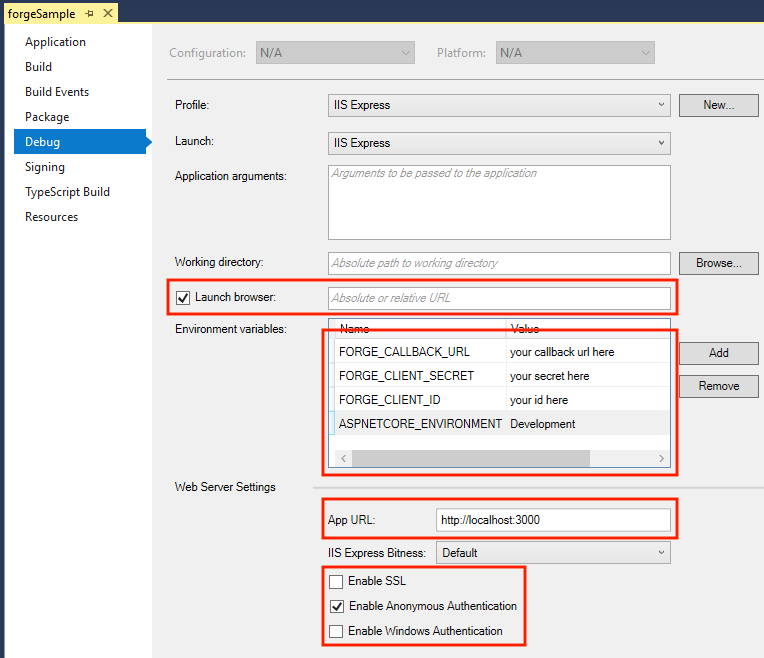
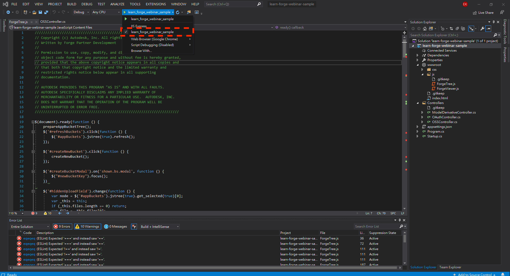
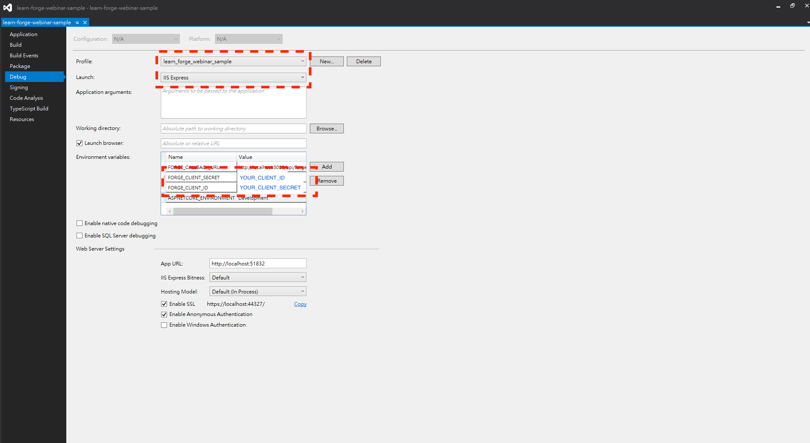

# # 章節二 Learn Forge網站簡介和開發專案基本設定章節自主練習

## 練習目標

1. 下載 [Learn Forge .net Core 練習樣版](https://github.com/yiskang/learn-forge-webinar-sample/tree/Step1-Empty-Template)
2. 設定自己的 Forge app `Client ID` 和 `Client Secret` 到練習樣版的環境變數

## 示範及說明影片

**Note.** 點擊下面的圖片以開啟 YouTube 影片

- 1.Learn Forge 範例簡介 
  - 

- 2.Learn Forge 練習樣版說明 
  - 

- 3.Learn Forge 範例前後端說明 
  - 

## 參考資料

 - [章節講議](README.md)
 - Visual Studio (Windows) 設定環境變數的方法
    - 
 - **Visual Studio (Windows)** 樣版設定注意事項，請依照紅框處設定
    - 
    - 

 

[回到首頁](../README.md)