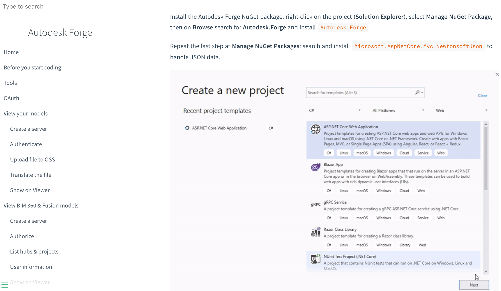
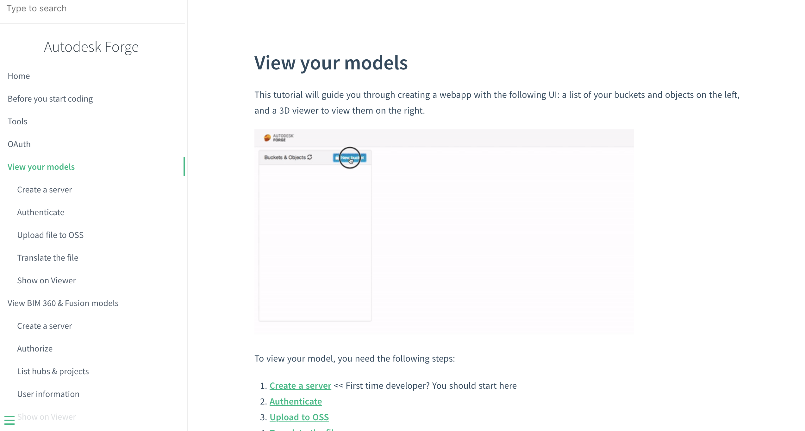

# 章節二 Learn Forge網站簡介和開發專案基本設定

## Learn Forge 網站簡介

[Learn Forge](https://learnforge.autodesk.io/#/?id=learn-autodesk-forge)，他是 **Autodesk Forge** 官方推出的教學網站，也是官方出的入門整合範例，其網站包含以下列表內容（子項目為使用到的 Forge API），並針對各個主題一步一步的帶領初接觸 Autodesk Forge 的使用者完成相關的應用程式，或是引導使用者如何進行 Forge 技術整合，本次活動將針對 View your model 這個主題帶領大家入門：

1. View your models **(本次主題)**
   - OAuth
   - Data Management API (OSS)
   - Model Derivative API
   - Viewer
2. View BIM 360 & Fusion models
   - OAuth
   - Data Management API (BIM360)
   - Viewer
3. Modify your models
   - OAuth
   - Design Automation API
   - Webhooks

 

 

## Learn Forge 練習樣版

本次活動將使用 [ASP.Net Core](https://zh.wikipedia.org/zh-tw/ASP.NET_Core) 這個技術進行相關的開發，並準備了 **Learn Forge .net Core 練習樣版** 讓為各位學員可以快速的上手，可以到 [https://github.com/yiskang/learn-forge-webinar-sample/tree/Step1-Empty-Template](https://github.com/yiskang/learn-forge-webinar-sample/tree/Step1-Empty-Template) 下載。

## 章節自主練習

[點我進入練習](Practice.md)

 

[回到首頁](../README.md)