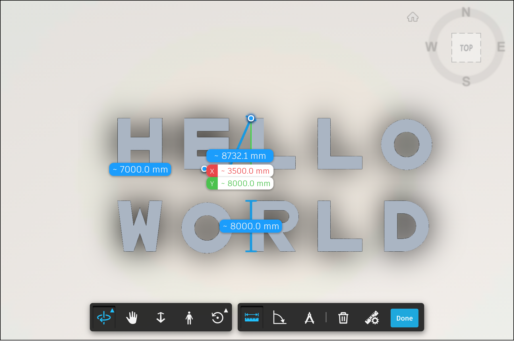

# 章節三 Forge Viewer 基本介紹

## Forge Viewer 簡介

Forge Viewer 又稱 **L**arge **M**odel **V**iewer，是基於 [three.js](https://threejs.org/) 開發的 JavaScript 程式庫，可以用來在網頁裡瀏覽、檢視、協作多種二維 (2D) 或三維 (3D) 的模型，並開放豐富的應用介面 (API) 來發展、擴充自有應用，其功能包含：

- 網頁式無外掛瀏覽，支援行動裝置的瀏覽器
- 剖切檢視、爆炸檢視、量測、漫遊
- 取得構件屬性或參數
- 豐富的擴充模組
- 搜尋、標記
- 圖紙超連結


## Forge Viewer 初始化工作流程

<div style="text-align:center">
  
</div>

## Forge Viewer 初始化範例

- 1.引用 Forge Viewer 的 JavaScript 程式庫

  - ```html
    <head>
        <meta name="viewport" content="width=device-width, minimum-scale=1.0, initial-scale=1, user-scalable=no" />
        <meta charset="utf-8">
        <link rel="stylesheet" href="https://developer.api.autodesk.com/modelderivative/v2/viewers/7.16/style.min.css" type="text/css">
        <script src="https://developer.api.autodesk.com/modelderivative/v2/viewers/7.16/viewer3D.js"></script>
        <style>
            body {
                margin: 0;
            }
    
            #forgeViewer {
                width: 100%;
                height: 100%;
                margin: 0;
                background-color: #F0F8FF;
            }
        </style>
    </head>
    <body>
        <div id="forgeViewer"></div>
    
        <script>
          // Viewer code goes here
        </script>
    </body>
    ```

- 2.初始化 Viewer

  - ```javascript
    function fetchForgeToken( callback ) {
      fetch( 'https://forge-token-srv.herokuapp.com/api/forge/oauth/token', {
        method: 'get',
        headers: new Headers({ 'Content-Type': 'application/json' }),
      })
        .then(( response ) => {
          if( response.status === 200 ) {
            return response.json();
          }
          return Promise.reject(
            new Error( `Failed to fetch token from server (status: ${response.status}, message: ${response.statusText})` ),
          );
        })
        .then(( data ) => {
          if( !data ) return Promise.reject( new Error( 'Empty token response' ) );
    
          callback( data.access_token, data.expires_in );
        })
        .catch( error => console.error( error ) );
    }
    
    var viewer = null;
    var options = {
        env: 'AutodeskProduction',
        getAccessToken: fetchForgeToken
    };
    
    Autodesk.Viewing.Initializer( options, function() {
        var htmlDiv = document.getElementById( 'forgeViewer' );
        viewer = new Autodesk.Viewing.GuiViewer3D( htmlDiv );
        var startedCode = viewer.start();
        if( startedCode > 0 ) {
            console.error( 'Failed to create a Viewer: WebGL not supported.' );
            return;
        }
    
        console.log( 'Initialization complete, loading a model next...' );
    
        // Read model vies code goes here
    });
    ```

- 3.讀取模型視圖 Manifest（可載入的模型視圖）

  - ```javascript
    var documentId = 'urn:dXJuOmFkc2sub2JqZWN0czpvcy5vYmplY3Q6bGt3ZWo3eHBiZ3A2M3g0aGwzMzV5Nm0yNm9ha2dnb2YyMDE3MDUyOHQwMjQ3MzIzODZ6L3JhY19iYXNpY19zYW1wbGVfcHJvamVjdC5ydnQ';
    Autodesk.Viewing.Document.load(
      documentId,
      onDocumentLoadSuccess,
      onDocumentLoadFailure
    );
    
    function onDocumentLoadSuccess(viewerDocument) {
      	/// Load model code goes here
    }
    
    function onDocumentLoadFailure() {
        console.error('Failed fetching Forge manifest');
    }
    ```

- 4.載入模型視圖（Viewable Bubble）

  - ```javascript
    var defaultModel = viewerDocument.getRoot().getDefaultGeometry();
    viewer.loadDocumentNode(viewerDocument, defaultModel);
    ```


## Forge Viewer UI功能簡介

- 1.Forge Viewer 模型剖切
  - 
- 2.Forge Viewer 模型量測
  - 

## 章節自主練習

[點我進入練習](Practice.md)

<br/>

[回到首頁](../README.md)