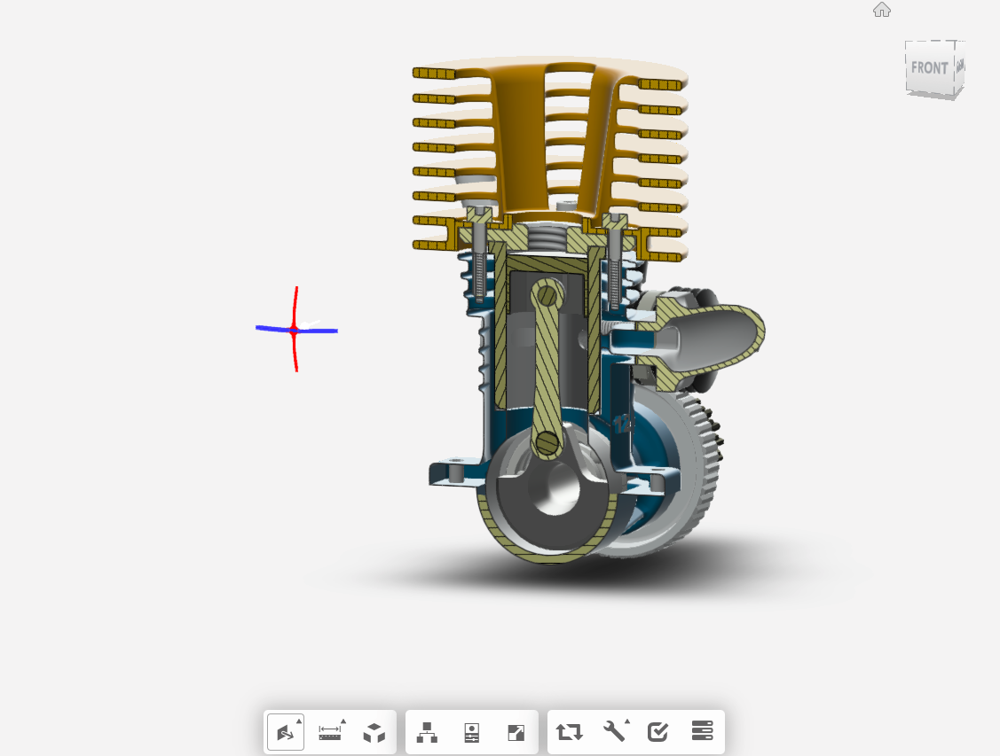
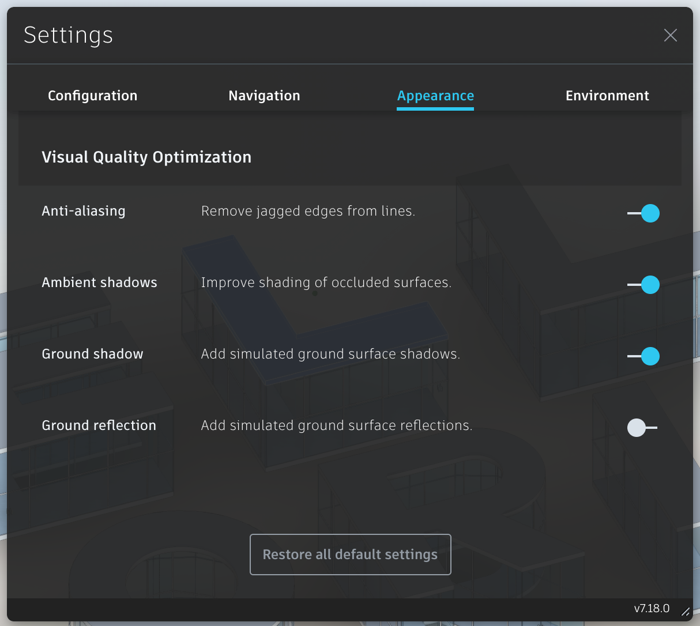

# 章節三 Forge Viewer 基本介紹

## Forge Viewer 簡介

Forge Viewer 又稱 **L**arge **M**odel **V**iewer，是基於 [three.js](https://threejs.org/) 開發的 JavaScript 程式庫，可以用來在網頁裡瀏覽、檢視、協作多種二維 (2D) 或三維 (3D) 的模型，並開放豐富的應用介面 (API) 來發展、擴充自有應用，其功能包含：

- 網頁式無外掛瀏覽，支援行動裝置的瀏覽器
- 剖切檢視、爆炸檢視、量測、漫遊
- 取得構件屬性或參數
- 豐富的擴充模組
- 搜尋、標記
- 圖紙超連結


## Forge Viewer 初始化工作流程

<div style="text-align:center">
  
</div>

## Forge Viewer 初始化範例

- 1.新增一個 `index.html`，並填入下面內容

  - ```html
      <html>
      <head>
          <meta name="viewport" content="width=device-width, minimum-scale=1.0, initial-scale=1, user-scalable=no" />
          <meta charset="utf-8">
          <style>
              body {
                  margin: 0;
              }
      
              #forgeViewer {
                  width: 100%;
                  height: 100%;
                  margin: 0;
                  background-color: #F0F8FF;
              }
          </style>
      </head>
      <body>
          <div id="forgeViewer"></div>
      
          <script>
            // Viewer code goes here
          </script>
      </body>
      </html>
      ```

- 2.在 `index.html` 裡引用 Forge Viewer 的 JavaScript 程式庫

  - ```html
    <html>
    <head>
        <meta name="viewport" content="width=device-width, minimum-scale=1.0, initial-scale=1, user-scalable=no" />
        <meta charset="utf-8">
        <link rel="stylesheet" href="https://developer.api.autodesk.com/modelderivative/v2/viewers/7.16/style.min.css" type="text/css">
        <script src="https://developer.api.autodesk.com/modelderivative/v2/viewers/7.16/viewer3D.js"></script>
        <style>
            body {
                margin: 0;
            }

            #forgeViewer {
                width: 100%;
                height: 100%;
                margin: 0;
                background-color: #F0F8FF;
            }
        </style>
    </head>
    <body>
        <div id="forgeViewer"></div>

        <script>
          // Viewer code goes here
        </script>
    </body>
    </html>
    ```

- 3.初始化 Viewer

  - ```javascript
    function fetchForgeToken( callback ) {
      fetch( 'https://forge-token-srv.herokuapp.com/api/forge/oauth/token', {
        method: 'get',
        headers: new Headers({ 'Content-Type': 'application/json' }),
      })
        .then(( response ) => {
          if( response.status === 200 ) {
            return response.json();
          }
          return Promise.reject(
            new Error( `Failed to fetch token from server (status: ${response.status}, message: ${response.statusText})` ),
          );
        })
        .then(( data ) => {
          if( !data ) return Promise.reject( new Error( 'Empty token response' ) );
    
          callback( data.access_token, data.expires_in );
        })
        .catch( error => console.error( error ) );
    }
    
    var viewer = null;
    var options = {
        env: 'AutodeskProduction',
        getAccessToken: fetchForgeToken
    };
    
    Autodesk.Viewing.Initializer( options, function() {
        var htmlDiv = document.getElementById( 'forgeViewer' );
        viewer = new Autodesk.Viewing.GuiViewer3D( htmlDiv );
        var startedCode = viewer.start();
        if( startedCode > 0 ) {
            console.error( 'Failed to create a Viewer: WebGL not supported.' );
            return;
        }
    
        console.log( 'Initialization complete, loading a model next...' );
    
        // Read model vies code goes here
    });
    ```

- 4.讀取模型視圖 Manifest（可載入的模型視圖）

  - ```javascript
    var documentId = 'urn:dXJuOmFkc2sub2JqZWN0czpvcy5vYmplY3Q6djBubW1ybnJ2dWpwZWl2Z3lvbXlwaWxxcGVodnRucHctcGVyc2lzdGVudC9hZHNrLWZvcmdlLWhlbGxvd29ybGQucnZ0';
    Autodesk.Viewing.Document.load(
      documentId,
      onDocumentLoadSuccess,
      onDocumentLoadFailure
    );

    function onDocumentLoadSuccess(viewerDocument) {
      /// Load model code goes here
    }

    function onDocumentLoadFailure() {
        console.error('Failed fetching Forge manifest');
    }
    ```

- 5.載入模型視圖（Viewable Bubble）

  - ```javascript
    var defaultModel = viewerDocument.getRoot().getDefaultGeometry();
    viewer.loadDocumentNode(viewerDocument, defaultModel);
    ```

- 6.用瀏覽器開啟 `index.html`


## Forge Viewer UI功能簡介


### 導覽工具

是一組用來操作 Viewer 相機及改變相機參數的工具，提供建模軟體軟體裡常見的模型導覽工具，其中包含：

- 相機操作工具：迴轉檢視、自由迴轉、平移、縮放、第一人稱
- 改變相機參數工具：縮放檢視、修改相機焦距、旋轉相機角度

### 模型工具

是一組用來操作模型的工具，其中包含：

#### 量測工具


#### 剖切工具



#### 爆炸工具


#### 模型結構樹


#### 模型屬性


### 設定工具

是一組用來管理 Viewer 相關設定的工具，其中包含：





### 視圖方塊

是一個用來協助操作視圖顯示方式、操作相機行為的工具，提供與設計軟體 (如Revit、Navisworks、AutoCAD等) 一樣的使用體驗


**Note.** 更多操作使用說明：<https://knowledge.autodesk.com/search-result/caas/CloudHelp/cloudhelp/ENU/Autodesk-360-New/files/GUID-522901FB-DDBF-49F3-B20F-110F14A1AC34-htm.html>

## 章節自主練習

[點我進入練習](Practice.md)

<br/>

[回到首頁](../README.md)