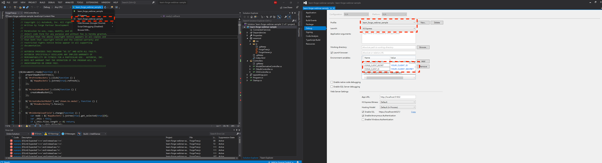

# 章節五 Forge 容器及物件管理（Bucket新增、條列及物件上傳）章節自主練習

## 練習目標

1. Learn Forge 前端頁面版面基本配置
2. 前端實作 ForgeTree.js，並完成下列功能
   - 實作 Bucket 新增按鈕及新增視窗
   - 實作 ForgeTree.js 透過  [jstree.js](https://www.jstree.com/) 條列出該 Forge App(`Client ID`)底下的所有 Bucket
   - 實作 ForgeTree.js 透過  [jstree.js](https://www.jstree.com/) 上傳物件（模型檔案）
   - 實作 ForgeTree.js 透過  [jstree.js](https://www.jstree.com/) 條列出所選的 Bucket 底下所有上傳的物件（模型檔案）
   - 實作 ForgeTree.js 透過  [jstree.js](https://www.jstree.com/) 刪除已上傳的物件（模型檔案）
   - 實作 ForgeTree.js 透過  [jstree.js](https://www.jstree.com/) 下載已上傳的物件（模型檔案）
3. 後端實作下列端點：
   - 透過 Forge .NET Client SDK 的 `BucketsApi` 實作建立新 Bucket 的端點： `POST /api/forge/oss/buckets`
   - 透過 Forge .NET Client SDK 的 `BucketsApi` 實作端點： `GET /api/forge/oss/buckets`
     - 條列該 Forge App(`Client ID`)底下的所有 Bucket
     - 條列 Bucket 底下所有上傳的物件（模型檔案）
   - 透過 Forge .NET Client SDK 的 ` ObjectsApi` 實作上傳物件（模型檔案）的端點： `POST /api/forge/oss/objects`
   - 透過 Forge .NET Client SDK 的 ` ObjectsApi` 實作刪除已上傳的物件（模型檔案）的端點： `DELETE /api/forge/oss/{bucketKey}/objects/{objectName}`
   - 透過 Forge .NET Client SDK 的 ` ObjectsApi` 實作下載已上傳的物件（模型檔案）的端點： `GET /api/forge/oss/{bucketKey}/objects/{objectName}/download`

## 示範及說明影片

**Note.** 點擊下面的圖片以開啟 YouTube 影片

- 1.Learn Forge 前端基本設定 
  - 

- 2.Learn Forge 前端頁面 Layout 簡介 
  - 

- 3.Learn Forge 容器樹/物件樹前端功能（jstree）實作 
  - 

- 4.前後端之間的互動 
  - 

- 5.Learn Forge 容器樹/物件樹後端功能實作 
  - 

## 參考資料

 - [章節講議](README.md)
 - 使用到的 Forge APIs
    - [https://forge.autodesk.com/en/docs/data/v2/reference/http/buckets-POST/](https://forge.autodesk.com/en/docs/data/v2/reference/http/buckets-POST/)
    - [https://forge.autodesk.com/en/docs/data/v2/reference/http/buckets-GET/](https://forge.autodesk.com/en/docs/data/v2/reference/http/buckets-GET/)
    - [https://forge.autodesk.com/en/docs/data/v2/reference/http/buckets-:bucketKey-objects-:objectName-PUT/](https://forge.autodesk.com/en/docs/data/v2/reference/http/buckets-:bucketKey-objects-:objectName-PUT/)
    - [https://forge.autodesk.com/en/docs/data/v2/reference/http/buckets-:bucketKey-objects-GET/](https://forge.autodesk.com/en/docs/data/v2/reference/http/buckets-:bucketKey-objects-GET/)
 - **Visual Studio (Windows)** 樣版設定注意事項，請依照紅框處設定
 - 

 

[回到首頁](../README.md)