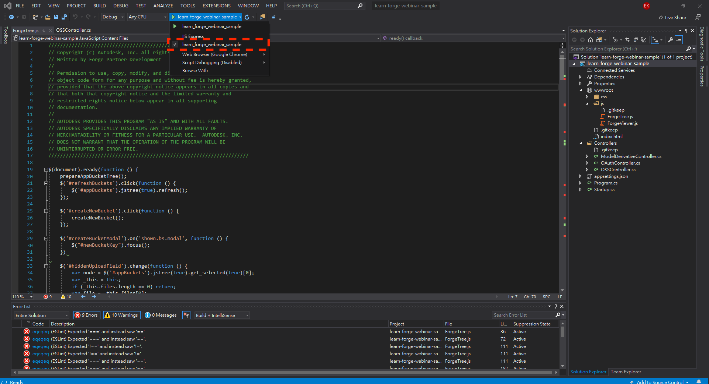
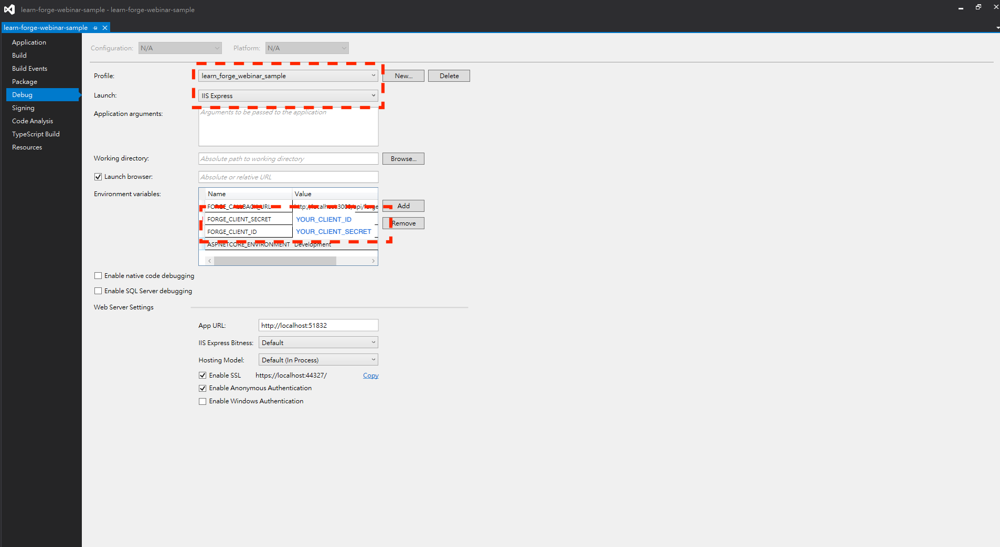

# 章節五 Forge 容器及物件管理（Bucket新增、條列及物件上傳）章節自主練習

## 練習目標

1. Learn Forge 前端頁面版面基本配置
2. 前端實作 ForgeTree.js，並完成下列功能
   - 實作 Bucket 新增按鈕及新增視窗
   - 實作 ForgeTree.js 透過  [jstree.js](https://www.jstree.com/) 條列出該 Forge App(`Client ID`)底下的所有 Bucket
   - 實作 ForgeTree.js 透過  [jstree.js](https://www.jstree.com/) 上傳物件（模型檔案）
   - 實作 ForgeTree.js 透過  [jstree.js](https://www.jstree.com/) 條列出所選的 Bucket 底下所有上傳的物件（模型檔案）
   - 實作 ForgeTree.js 透過  [jstree.js](https://www.jstree.com/) 刪除已上傳的物件（模型檔案）
   - 實作 ForgeTree.js 透過  [jstree.js](https://www.jstree.com/) 下載已上傳的物件（模型檔案）
3. 後端實作下列端點：
   - 透過 Forge .NET Client SDK 的 `BucketsApi` 實作建立新 Bucket 的端點： `POST /api/forge/oss/buckets`
   - 透過 Forge .NET Client SDK 的 `BucketsApi` 實作端點： `GET /api/forge/oss/buckets`
     - 條列該 Forge App(`Client ID`)底下的所有 Bucket
     - 條列 Bucket 底下所有上傳的物件（模型檔案）
   - 透過 Forge .NET Client SDK 的 `ObjectsApi` 實作上傳物件（模型檔案）的端點： `POST /api/forge/oss/objects`
   - 透過 Forge .NET Client SDK 的 `ObjectsApi` 實作刪除已上傳的物件（模型檔案）的端點： `DELETE /api/forge/oss/{bucketKey}/objects/{objectName}`
   - 透過 Forge .NET Client SDK 的 `ObjectsApi` 實作下載已上傳的物件（模型檔案）的端點： `GET /api/forge/oss/{bucketKey}/objects/{objectName}/download`

## 示範及說明影片

**Note.** 點擊下面的圖片以開啟 YouTube 影片

- 1.Learn Forge 前端基本設定<br/>
  - [](http://www.youtube.com/watch?v=IJzVXneHXf4 "5.1-Frontend basic setup")

- 2.Learn Forge 前端頁面 Layout 簡介<br/>
  - [](http://www.youtube.com/watch?v=kpif9-8Jq7c "5.2-Frontend Page Layout Intro")

- 3.Learn Forge 容器樹/物件樹前端功能（jstree）實作<br/>
  - [](http://www.youtube.com/watch?v=ooeHTzR8DFU "5.3-Frontend Forge bucket tree Implementation")

- 4.前後端之間的互動<br/>
  - [](http://www.youtube.com/watch?v=MelTqIexe9Q "5.4-Backend basic intro")

- 5.Learn Forge 容器樹/物件樹後端功能實作<br/>
  - [](http://www.youtube.com/watch?v=WGwIFysJlBg "5.5-Backend Forge bucket tree Implementation")

- 6.Learn Forge 物件樹刪除已上傳檔案之功能實作<br/>
  - [](http://www.youtube.com/watch?v=4DJ7Gv49wsM "5.6-Forge bucket object deletion")

- 7.Learn Forge 物件樹下載已上傳檔案之功能實作<br/>
  - [](http://www.youtube.com/watch?v=hDj01Wjn2wk "5.7-Forge bucket object download")

## 程式碼補充

### 前端

#### ForgeTree.js

```javascript

$(document).ready(function () {
    prepareAppBucketTree();
    $('#refreshBuckets').click(function () {
        $('#appBuckets').jstree(true).refresh();
    });

    $('#createNewBucket').click(function () {
        createNewBucket();
    });

    $('#createBucketModal').on('shown.bs.modal', function () {
        $("#newBucketKey").focus();
    })
});
```

### 後端

#### OAuthController.cs

```c#
using Autodesk.Forge;
using Microsoft.AspNetCore.Mvc;
using System;
using System.Threading.Tasks;

namespace learn_forge_webinar_sample.Controllers
{
    [ApiController]
    public class OAuthController : ControllerBase
    {
        // As both internal & public tokens are used for all visitors
        // we don't need to request a new token on every request, so let's
        // cache them using static variables. Note we still need to refresh
        // them after the expires_in time (in seconds)
        private static dynamic InternalToken { get; set; }
        private static dynamic PublicToken { get; set; }

        /// <summary>
        /// Get access token with public (viewables:read) scope
        /// </summary>
        [HttpGet]
        [Route("api/forge/oauth/token")]
        public async Task<dynamic> GetPublicAsync()
        {
            if (PublicToken == null || PublicToken.ExpiresAt < DateTime.UtcNow)
            {
                PublicToken = await Get2LeggedTokenAsync(new Scope[] { Scope.ViewablesRead });
                PublicToken.ExpiresAt = DateTime.UtcNow.AddSeconds(PublicToken.expires_in);
            }
            return PublicToken;
        }

        /// <summary>
        /// Get access token with internal (write) scope
        /// </summary>
        public static async Task<dynamic> GetInternalAsync()
        {
            if (InternalToken == null || InternalToken.ExpiresAt < DateTime.UtcNow)
            {
                InternalToken = await Get2LeggedTokenAsync(new Scope[] { Scope.BucketCreate, Scope.BucketRead, Scope.BucketDelete, Scope.DataRead, Scope.DataWrite, Scope.DataCreate, Scope.CodeAll });
                InternalToken.ExpiresAt = DateTime.UtcNow.AddSeconds(InternalToken.expires_in);
            }

            return InternalToken;
        }

        /// <summary>
        /// Get the access token from Autodesk
        /// </summary>
        private static async Task<dynamic> Get2LeggedTokenAsync(Scope[] scopes)
        {
            TwoLeggedApi oauth = new TwoLeggedApi();
            string grantType = "client_credentials";
            dynamic bearer = await oauth.AuthenticateAsync(
              GetAppSetting("FORGE_CLIENT_ID"),
              GetAppSetting("FORGE_CLIENT_SECRET"),
              grantType,
              scopes);
            return bearer;
        }

        /// <summary>
        /// Reads appsettings from web.config
        /// </summary>
        public static string GetAppSetting(string settingKey)
        {
            return Environment.GetEnvironmentVariable(settingKey);
        }
    }
}
```

#### OSSController.cs

```c#
using Autodesk.Forge;
using Autodesk.Forge.Model;
using Microsoft.AspNetCore.Hosting;
using Microsoft.AspNetCore.Http;
using Microsoft.AspNetCore.Mvc;
using System.Collections.Generic;
using System.IO;
using System.Threading.Tasks;

namespace learn_forge_webinar_sample.Controllers
{
    [ApiController]
    public class OSSController : ControllerBase
    {
        private IWebHostEnvironment _env;
        public OSSController(IWebHostEnvironment env) { _env = env; }
        public string ClientId { get { return OAuthController.GetAppSetting("FORGE_CLIENT_ID").ToLower(); } }

        /// <summary>
        /// Model data for jsTree used on GetOSSAsync
        /// </summary>
        public class TreeNode
        {
            public TreeNode(string id, string text, string type, bool children)
            {
                this.id = id;
                this.text = text;
                this.type = type;
                this.children = children;
            }

            public string id { get; set; }
            public string text { get; set; }
            public string type { get; set; }
            public bool children { get; set; }
        }

        /// <summary>
        /// Input model for CreateBucket method
        /// </summary>
        public class CreateBucketModel
        {
            public string bucketKey { get; set; }
        }

        public class UploadFile
        {
            public string bucketKey { get; set; }
            public IFormFile fileToUpload { get; set; }
        }

        /// <summary>
        /// Base64 enconde a string
        /// </summary>
        public static string Base64Encode(string plainText)
        {
            var plainTextBytes = System.Text.Encoding.UTF8.GetBytes(plainText);
            return System.Convert.ToBase64String(plainTextBytes);
        }
    }
}
```

## 參考資料

 - [章節講議](README.md)
 - 使用到的 Forge APIs
    - [https://forge.autodesk.com/en/docs/data/v2/reference/http/buckets-POST/](https://forge.autodesk.com/en/docs/data/v2/reference/http/buckets-POST/)
    - [https://forge.autodesk.com/en/docs/data/v2/reference/http/buckets-GET/](https://forge.autodesk.com/en/docs/data/v2/reference/http/buckets-GET/)
    - [https://forge.autodesk.com/en/docs/data/v2/reference/http/buckets-:bucketKey-objects-:objectName-PUT/](https://forge.autodesk.com/en/docs/data/v2/reference/http/buckets-:bucketKey-objects-:objectName-PUT/)
    - [https://forge.autodesk.com/en/docs/data/v2/reference/http/buckets-:bucketKey-objects-GET/](https://forge.autodesk.com/en/docs/data/v2/reference/http/buckets-:bucketKey-objects-GET/)
 - **Visual Studio (Windows)** 樣版設定注意事項，請依照紅框處設定
 - 
 - 

<br/>

[回到首頁](../README.md)
