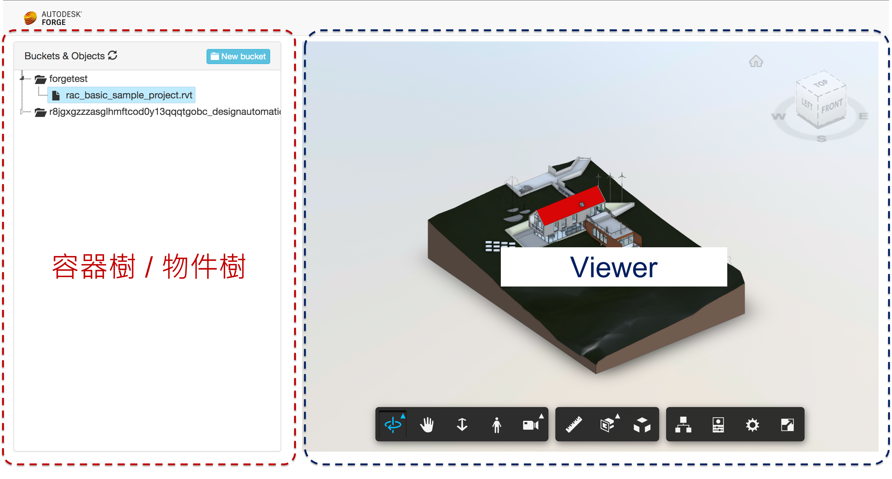

# 章節五 Forge 容器及物件管理（Bucket新增、條列及物件上傳）

## Learn Forge 前端基本設定

Learn Forge 前端網頁使用下面這些第三方程式庫來完成頁面配置、使用者互動及前後端資料傳遞：

- 首頁 (HTML)
- [Bootstrap v3](https://getbootstrap.com/docs/3.4/)
- [jQuery.js](https://jquery.com/)
- [jstree.js](https://www.jstree.com/)



## Learn Forge 前端頁面 Layout 簡介

Learn Forge 前端網頁主要可以分為左右兩邊：

- 左邊 - 容器樹 / 物件樹：
  - 透過 jstree 實作查看 Bucket、建立 Bucket 和上傳物件（模型檔案）
- 右邊：模型檢視器：
  - 透過 Forge Viewer 載入左邊物件數所選的模型視圖


## Learn Forge 容器及物件管理功能簡介

### 查看 Bucket

- 前端
  
  - ```javascript
    function prepareAppBucketTree() {
      $('#appBuckets').jstree({
        'core': {
          'themes': { "icons": true },
          'data': {
            "url": '/api/forge/oss/buckets',
            "dataType": "json",
            'multiple': false,
            "data": function (node) {
              return { "id": node.id };
            }
          }
        },
        'types': {
          'default': {
            'icon': 'glyphicon glyphicon-question-sign'
          },
          '#': {
            'icon': 'glyphicon glyphicon-cloud'
          },
          'bucket': {
            'icon': 'glyphicon glyphicon-folder-open'
          },
          'object': {
            'icon': 'glyphicon glyphicon-file'
          }
        },
        "plugins": ["types", "state", "sort", "contextmenu"],
        contextmenu: { items: autodeskCustomMenu }
      }).on('loaded.jstree', function () {
        $('#appBuckets').jstree('open_all');
      })
    ```
- 後端
  
  - ```c#
    /// <summary>
    /// Return list of buckets (id=#) or list of objects (id=bucketKey)
    /// </summary>
    [HttpGet]
    [Route("api/forge/oss/buckets")]
    public async Task<IList<TreeNode>> GetOSSAsync(string id)
    {
        IList<TreeNode> nodes = new List<TreeNode>();
        dynamic oauth = await OAuthController.GetInternalAsync();
    
        if (id == "#") // root
        {
            // in this case, let's return all buckets
            BucketsApi appBckets = new BucketsApi();
            appBckets.Configuration.AccessToken = oauth.access_token;
    
            // to simplify, let's return only the first 100 buckets
            dynamic buckets = await appBckets.GetBucketsAsync("US", 100);
            foreach (KeyValuePair<string, dynamic> bucket in new DynamicDictionaryItems(buckets.items))
            {
                nodes.Add(new TreeNode(bucket.Value.bucketKey, bucket.Value.bucketKey.Replace(ClientId + "-", string.Empty), "bucket", true));
            }
        }
        else
        {
            // as we have the id (bucketKey), let's return all 
            ObjectsApi objects = new ObjectsApi();
            objects.Configuration.AccessToken = oauth.access_token;
            var objectsList = objects.GetObjects(id);
            foreach (KeyValuePair<string, dynamic> objInfo in new DynamicDictionaryItems(objectsList.items))
            {
                nodes.Add(new TreeNode(Base64Encode((string)objInfo.Value.objectId),
                  objInfo.Value.objectKey, "object", false));
            }
        }
        return nodes;
    }
    ```

### 建立、新增 Bucket

- 前端
  
  - ```javascript
    function createNewBucket() {
      var bucketKey = $('#newBucketKey').val();
      jQuery.post({
        url: '/api/forge/oss/buckets',
        contentType: 'application/json',
        data: JSON.stringify({ 'bucketKey': bucketKey }),
        success: function (res) {
          $('#appBuckets').jstree(true).refresh();
          $('#createBucketModal').modal('toggle');
        },
        error: function (err) {
          if (err.status == 409)
            alert('Bucket already exists - 409: Duplicated')
          console.log(err);
        }
      });
    }
    ```
- 後端
  
  - ```c#
    /// <summary>
    /// Create a new bucket 
    /// </summary>
    [HttpPost]
    [Route("api/forge/oss/buckets")]
    public async Task<dynamic> CreateBucket([FromBody]CreateBucketModel bucket)
    {
        BucketsApi buckets = new BucketsApi();
        dynamic token = await OAuthController.GetInternalAsync();
        buckets.Configuration.AccessToken = token.access_token;
        PostBucketsPayload bucketPayload = new PostBucketsPayload(string.Format("{0}-{1}", ClientId, bucket.bucketKey.ToLower()), null,
          PostBucketsPayload.PolicyKeyEnum.Transient);
        return await buckets.CreateBucketAsync(bucketPayload, "US");
    }
    ```

### 上傳物件 (模型檔案)

- 前端
  
  - ```javascript
    $('#hiddenUploadField').change(function () {
        var node = $('#appBuckets').jstree(true).get_selected(true)[0];
        var _this = this;
        if (_this.files.length == 0) return;
        var file = _this.files[0];
        switch (node.type) {
          case 'bucket':
            var formData = new FormData();
            formData.append('fileToUpload', file);
            formData.append('bucketKey', node.id);
    
            $.ajax({
              url: '/api/forge/oss/objects',
              data: formData,
              processData: false,
              contentType: false,
              type: 'POST',
              success: function (data) {
                $('#appBuckets').jstree(true).refresh_node(node);
                _this.value = '';
              }
            });
            break;
        }
      });
    ```
- 後端
  
  - ```c#
    /// <summary>
    /// Receive a file from the client and upload to the bucket
    /// </summary>
    /// <returns></returns>
    [HttpPost]
    [Route("api/forge/oss/objects")]
    public async Task<dynamic> UploadObject([FromForm]UploadFile input)
    {
        // save the file on the server
        var fileSavePath = Path.Combine(_env.ContentRootPath, input.fileToUpload.FileName);
        using (var stream = new FileStream(fileSavePath, FileMode.Create))
            await input.fileToUpload.CopyToAsync(stream);
    
    
        // get the bucket...
        dynamic oauth = await OAuthController.GetInternalAsync();
        ObjectsApi objects = new ObjectsApi();
        objects.Configuration.AccessToken = oauth.access_token;
    
        // upload the file/object, which will create a new object
        dynamic uploadedObj;
        using (StreamReader streamReader = new StreamReader(fileSavePath))
        {
            uploadedObj = await objects.UploadObjectAsync(input.bucketKey,
                   input.fileToUpload.FileName, (int)streamReader.BaseStream.Length, streamReader.BaseStream,
                   "application/octet-stream");
        }
    
        // cleanup
        System.IO.File.Delete(fileSavePath);
    
        return uploadedObj;
    }
    ```

## 章節自主練習

[點我進入練習](Practice.md)

<br/>

[回到首頁](../README.md)