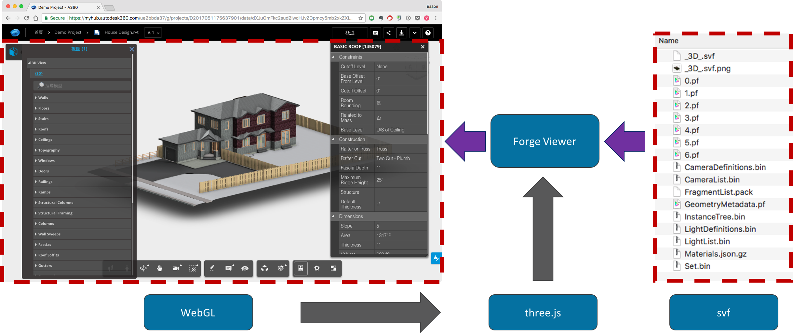

# 章節七 Forge 模型檢視

## Forge Viewer 簡介

### Forge Viewer 技術簡易架構



### Forge Viewer 實作

- 1.新增一個 `ForgeViewer.js` 並將下面內容依指示填上

- 2.實作 `launchViewer( urn )`，把 viewer 變數和 launchViewer 函式 填到 `ForgeViewer.js` 裡面

  - ```javascript
    var viewer;

    function launchViewer(urn) {
      // 初始化 Viewer 的程式碼貼這
    }
    ```

- 3.初始化 Viewer

  - ```javascript
    function getForgeToken(callback) {
      fetch('/api/forge/oauth/token').then(res => {
        res.json().then(data => {
          callback(data.access_token, data.expires_in);
        });
      });
    }

    var options = {
      env: 'AutodeskProduction',
      getAccessToken: getForgeToken
    };

    Autodesk.Viewing.Initializer(options, () => {
      var htmlDiv = document.getElementById( 'forgeViewer' );
      viewer = new Autodesk.Viewing.GuiViewer3D( htmlDiv, { extensions: [ 'Autodesk.DocumentBrowser'] });

      viewer.start();
      var documentId = 'urn:' + urn;

      // 讀取模型視圖 Manifest（可載入的模型視圖）的程式碼貼這
    });
    ```

- 4.讀取模型視圖 Manifest（可載入的模型視圖）

  - ```javascript
    Autodesk.Viewing.Document.load(
      documentId,
      onDocumentLoadSuccess,
      onDocumentLoadFailure
    );

    function onDocumentLoadSuccess(viewerDocument) {
      // 載入模型視圖（Viewable Bubble）的程式碼貼這
    }

    function onDocumentLoadFailure() {
        console.error('Failed fetching Forge manifest');
    }
    ```

- 4.載入模型視圖（Viewable Bubble）

  - ```javascript
    var defaultModel = viewerDocument.getRoot().getDefaultGeometry();
    viewer.loadDocumentNode(viewerDocument, defaultModel);
    ```

## 章節自主練習

[點我進入練習](Practice.md)

<br/>

[回到首頁](../README.md)