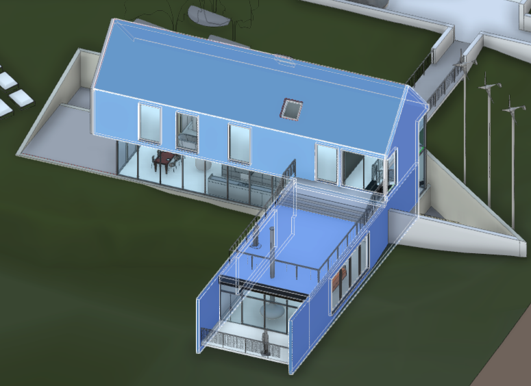
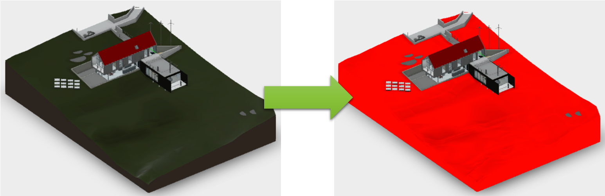
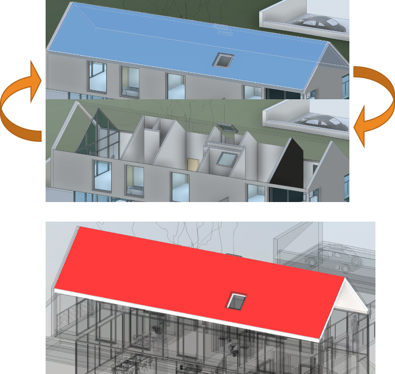
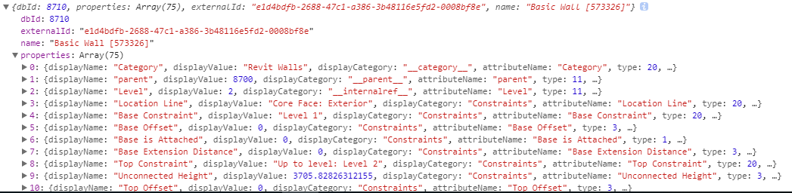

# 章節八 Forge Viewer 功能及API示範

## 基礎用法

### 選擇集



#### [選取元件 (設定選擇集)](https://forge.autodesk.com/en/docs/viewer/v7/reference/Viewing/Viewer3D/#select-dbids-model-selectiontype)

```javascript
viewer.select( 2102 );

//或

viewer.select( [ 2210, 2585, 4009 ] );
```

#### [取得目前已選取的元件](https://forge.autodesk.com/en/docs/viewer/v7/reference/Viewing/Viewer3D/#getselection)

```javascript

viewer.getSelection();

// [ 2106, 2214, 2589, 2591, 3496 ]
```

#### [清除選取狀態 (清除選擇集)](https://forge.autodesk.com/en/docs/viewer/v7/reference/Viewing/Viewer3D/#clearselection)

```javascript
viewer.clearSelection();
```

### 元件外觀



#### [改變顏色](https://forge.autodesk.com/en/docs/viewer/v7/reference/Viewing/Viewer3D/#setthemingcolor-dbid-color-model-recursive)

```javascript
const color = new THREE.Vector4( 255/255, 0, 0, 1 );

viewer.setThemingColor( 2102, color );
```

#### [清除顏色](https://forge.autodesk.com/en/docs/viewer/v7/reference/Viewing/Viewer3D/#clearthemingcolors-model)

```javascript
viewer.clearThemingColors();

// 或

viewer.setThemingColor( 2102, null );
```

### 元件可視性



#### [隱藏元件](https://forge.autodesk.com/en/docs/viewer/v7/reference/Viewing/Viewer3D/#hide-node-model)

```javascript
viewer.hide( 2102 );

// 或

viewer.hide( [ 2210, 2585, 4009 ] );
```

#### [顯示元件](https://forge.autodesk.com/en/docs/viewer/v7/reference/Viewing/Viewer3D/#show-node-model)

```javascript
viewer.show( 2102 );

// 或

viewer.show( [ 2210, 2585, 4009 ] );
```

#### [隔離元件](https://forge.autodesk.com/en/docs/viewer/v7/reference/Viewing/Viewer3D/#isolate-node-model)

```javascript
viewer.isolate( 2102 );

// 或

viewer.isolate( [ 2210, 2585, 4009 ] );
```

#### [顯示所有元件](https://forge.autodesk.com/en/docs/viewer/v7/reference/Viewing/Viewer3D/#showall)

```javascript
viewer.showAll();
```

### [取得元件屬性(性質)](https://forge.autodesk.com/en/docs/viewer/v7/reference/Viewing/Viewer3D/#getproperties-dbid-onsuccesscallback-onerrorcallback)

;

```javascript
function onGetPropertiesSuccess( result ) {
  console.log( result );
}

function onGetPropertiesFailed( error ) {
  console.error( error );
}

viewer.getproperties(
  2102,
  onGetPropertiesSuccess,
  onGetPropertiesFailed
);
```

### 事件管理

#### 常見的事件

事件名稱                 | 說明
------------------------|-----------
SELECTION_CHANGED_EVENT | 選擇集變更
GEOMETRY_LOADED_EVENT   | 模型載入完成
ISOLATE_EVENT           | API isolate() 執行時觸發
HIDE_EVENT              | API hide() 執行時觸發
SHOW_EVENT              | API show() 執行時觸發
NAVIGATION_MODE_CHANGED_EVENT | Viewer導覽工具變更
CAMERA_TRANSITION_COMPLETED   | Viewer 相機動作完成
TOOLBAR_CREATED_EVENT         | Viewer 工具列已產生

#### 監聽事件範例

##### 選擇集變更事件

```javascript
function onSelectionChange( event ) {
    const dbIds = event.dbIdArray;

    if( dbIds.length > 0 ) {
        // 處理已選取元件的邏輯
    } else {
        // 處理沒有選取元件的邏輯
    }
}

// 新增監聽事件
viewer.addEventListener(
    Autodesk.Viewing.SELECTION_CHANGED_EVENT,
    onSelectionChange
);

// 移除監聽事件
viewer.removeEventListener(
    Autodesk.Viewing.SELECTION_CHANGED_EVENT,
    onSelectionChange
);
```

##### 相機移動完成事件

```javascript
function onFocusCompleted() {
    // 相機縮放指定元件後要做的事情
    viewer.removeEventListener(
        Autodesk.Viewing.CAMERA_TRANSITION_COMPLETED,
        onFocusCompleted
    );

    console.log( 'Focused to element' );
    viewer.select( 2102 );
}

// 新增監聽事件
viewer.addEventListener(
    Autodesk.Viewing.CAMERA_TRANSITION_COMPLETED,
    onFocusCompleted
);

// 將相機縮放指定元件旁邊
viewer.fitToView( [ 2102 ] );
```

## 進階用法

### [元件搜詢](https://forge.autodesk.com/en/docs/viewer/v7/reference/Viewing/Viewer3D/#search-text-onsuccesscallback-onerrorcallback-attributenames)

```javascript
function onSearchSuccessCallback( dbIds ) {
  console.log( dbIds );
}

function onSearchFailedCallback( error ) {
  console.error( error );
}

viewer.search(
  'curtain wall',
  onSearchSuccessCallback,
  onSearchFailedCallback
);
```

**Note.** [延伸閱讀 - .search method performance](https://forge.autodesk.com/blog/search-method-performance)

### [取得大量的屬性](https://forge.autodesk.com/en/docs/viewer/v7/reference/Viewing/Model/#getbulkproperties-dbids-options-onsuccesscallback-onerrorcallback)

```javascript
function onGetBulkPropsSuccessCallback( results ) {
  console.log( results );
}

function onGetBulkPropsFailedCallback( error ) {
  console.error( error );
}

viewer.model.getBulkProperties(
  [ 2210, 2585, 4009 ],
  onGetBulkPropsSuccessCallback,
  onGetBulkPropsFailedCallback
);
```

### 上述兩個 API 的結合

```javascript
viewer.search( 'Steel', function( dbIds ){
   viewer.model.getBulkProperties( dbIds, [ 'Mass' ],
   function( elements ){
     let totalMass = 0;
     for( let i=0; i<elements.length; i++ ) {
       totalMass += elements[i].properties[0].displayValue;
     }
     console.log( totalMass );
   })
}, null, [ 'Material' ] );
```

### 元件 (階層) 樹

#### [取得元件階層樹](https://forge.autodesk.com/en/docs/viewer/v7/reference/Viewing/Model/#getinstancetree)

```javascript
viewer.model.getInstanceTree();

// 或

function onGetInstanceTreeSuccessCallback( tree ) {
  console.log( tree );
}

function onGetInstanceTreeFailedCallback( error ) {
  console.error() error );
}

viewer.getObjectTree(
  onGetInstanceTreeSuccessCallback,
  onGetInstanceTreeFailedCallback
);
```

### [取得元件的名字](https://forge.autodesk.com/en/docs/viewer/v7/reference/Private/InstanceTree/#getnodename-dbid)

```javascript
let it = viewer.model.getInstanceTree();

it.getNodeName( dbId );
```

#### [走遍整顆元件樹](https://forge.autodesk.com/en/docs/viewer/v7/reference/Private/InstanceTree/#enumnodechildren-node-callback-recursive)

```javascript
it.enumNodeChildren( dbId, function( childId ) {
  let childName = it.getNodeName(childId);
  console.log( childName );
});
```

#### 重建元件樹階層

```javascript
function buildModelTree( model ) {

  //builds model tree recursively
  function _buildModelTreeRec( node ) {

    it.enumNodeChildren( node.dbId, function(childId) {
        node.children = node.children || [];

        const childNode = {
          dbId: childId,
          name: it.getNodeName( childId )
        };

        node.children.push( childNode );

        _buildModelTreeRec( childNode );
      });

  }

  //get model instance tree and root component
  const it = model.getInstanceTree();
  const rootId = it.getRootId();

  const rootNode = {
    dbId: rootId,
    name: it.getNodeName( rootId )
  };

  _buildModelTreeRec( rootNode );

  return rootNode;
}

let root = buildModelTree( viewer.model );
```

<br/>

[回到首頁](../README.md)